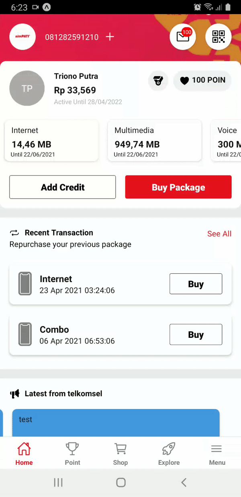

# mytelkomsel-android-homepage-clone

Beberapa bulan lalu saya coba belajar membuat aplikasi android menggunakan react native karena sebelum saya selalu menggunakan java native, kasus yang saya ambil adalah saya membuat clone UI aplikasi mytelkomsel, Tapi sayanya belum selesai saya kerjaan semua halaman mytelkomsel sudah berganti tampilan ;(

## Prerequisites

- [Git](https://git-scm.com/)
- [Node.js and npm](nodejs.org) Node 14.16.1, npm 7.11.2


## Installation
```sh
$ git clone https://github.com/trionoputra/mytelkomsel-android-homepage-clone.git
$ cd mytelkomsel-android-homepage-clone/
$ npm install
$ npm run android
```
</img>
